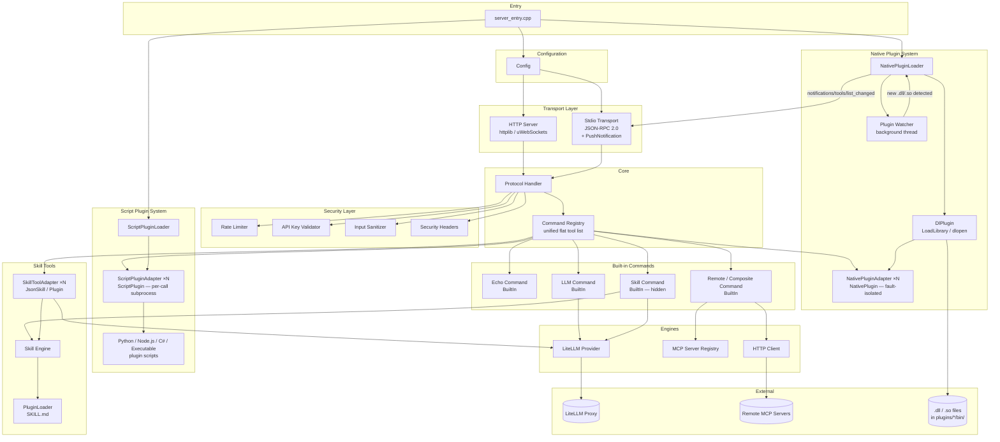
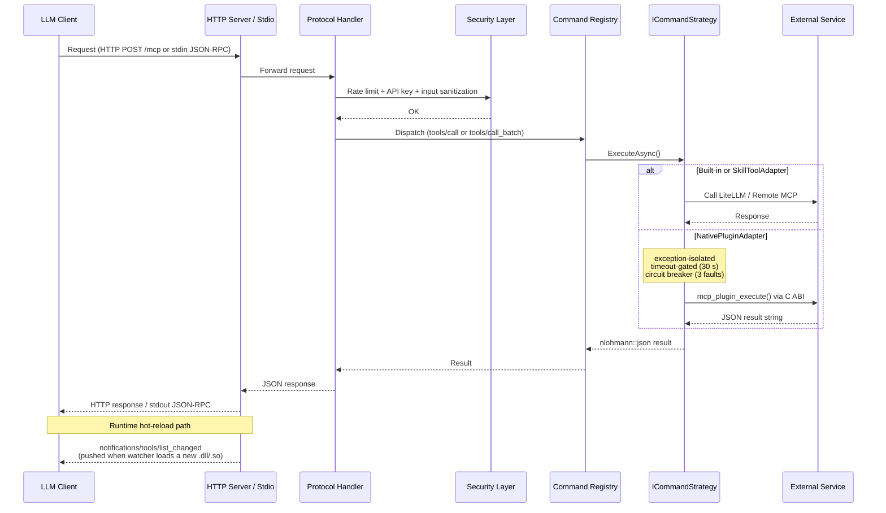
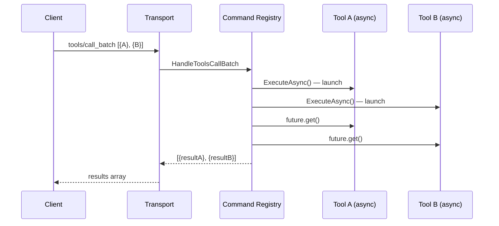

# Architecture

## High-Level Component Diagram



**Key design decisions:**

| Decision | Rationale |
| -------- | --------- |
| **Unified `CommandRegistry`** | Every tool — built-in, JSON skill, SKILL.md plugin, native DL plugin, script plugin — is a flat `ICommandStrategy`. `tools/list` is a single filtered view. |
| **`skill` meta-tool hidden** | Kept for backward compat but `m_Hidden = true` so it doesn't appear in `tools/list`. Skills are promoted as individual first-class tools. |
| **C ABI for native plugins** | `extern "C"` is the only ABI that is stable across compilers, compiler versions, and standard libraries. Plugin authors compile with any toolchain. |
| **`NativePluginAdapter` fault isolation** | Three protection layers: exception catch → `isError`, 30 s `wait_for` timeout, circuit breaker after 3 faults. A broken plugin cannot crash the host. |
| **Runtime watcher + MCP notification** | The watcher polls `plugins/*/bin/` every 2 s. When a new DL appears it loads, registers tools, and pushes `notifications/tools/list_changed` to the stdio client so LLMs refresh their tool list without reconnecting. |

---

## Request Flow



### Parallel Execution (`tools/call_batch`)

All calls in a batch are launched as `std::async` futures before any `.get()` is called — true within-request parallelism. Total latency ≈ max(individual latencies).



---

## Directory Structure

```text
MCP_Open/
├── include/                  # Public headers
│   ├── commands/             #   CommandRegistry, ICommandStrategy, ToolMetadata
│   │                         #     ToolSource: BuiltIn | JsonSkill | Plugin | NativePlugin | ScriptPlugin
│   ├── core/                 #   ProtocolHandler, Config, Logger, ThreadPool
│   ├── discovery/            #   McpServerRegistry, CompositeCommand
│   ├── http/                 #   IHttpClient
│   ├── llm/                  #   ILLMProvider, LiteLLMProvider, LLMCommand
│   ├── plugins/              #   Plugin systems
│   │   ├── PluginABI.h       #     Stable extern "C" ABI contract (native plugin authors include this)
│   │   ├── IPlugin.h         #     Abstract C++ interface (mockable in tests)
│   │   ├── DlPlugin.h        #     Concrete LoadLibrary/dlopen loader
│   │   ├── NativePluginAdapter.h  # ICommandStrategy wrapper with fault isolation
│   │   ├── NativePluginLoader.h  # Directory scanner, watcher, notify callback
│   │   ├── ScriptPlugin.h    #     POD structs: ScriptPluginToolInfo, ScriptPlugin
│   │   ├── ScriptPluginAdapter.h # ICommandStrategy wrapper — per-call subprocess spawn
│   │   └── ScriptPluginLoader.h  # Scans plugin dirs for plugin.json with "runtime" key
│   ├── security/             #   RateLimiter, ApiKeyValidator, SecurityHeaders
│   ├── server/               #   IServer, HttplibServer, UwsServer, StdioTransport
│   ├── skills/               #   SkillEngine, SkillCommand, SkillToolAdapter, PluginLoader
│   └── validation/           #   InputSanitizer, JsonSchemaValidator
├── src/                      # Implementation files (mirrors include/)
│   ├── plugins/              #   DlPlugin.cpp, NativePluginAdapter.cpp, NativePluginLoader.cpp
│   │                         #   ScriptPluginAdapter.cpp, ScriptPluginLoader.cpp
│   └── ...
├── plugins/                  # Plugin directory (loaded at runtime) — see plugins/README.md
│   ├── desktop-notification/ #   Native plugin — desktop notifications
│   ├── example-plugin/       #   Reference native plugin (ping + base64_encode)
│   ├── git-tools/            #   Script plugin — git operations
│   ├── github-tools/         #   Script plugin — GitHub API integration
│   ├── github-actions/       #   Script plugin — GitHub Actions management
│   ├── entrian-search/       #   Skill plugin — Entrian source search
│   └── everything-search/    #   Skill plugin — Everything file search
├── skills/                   # JSON skill definitions (loaded at startup)
│   ├── code_review.json
│   ├── summarize.json
│   └── translate.json
├── capi/                     # C API for FFI / P/Invoke
│   ├── include/mcp_capi.h
│   └── src/mcp_capi.cpp
├── csharp/                   # C# wrapper (McpClient.csproj)
├── config/                   # Example configuration files
├── tests/                    # Unit tests (GTest / Catch2) — 179 tests (167 pass, 12 skip without Python)
│   └── test_plugins/         #   Fixture script plugins used by integration tests
│       └── echo-plugin/      #     echo_tool + fail_tool Python plugin
├── litellm/                  # LiteLLM proxy launcher & config
├── CMakeLists.txt            # Build system
└── BUILD.md                  # Detailed build instructions
```
