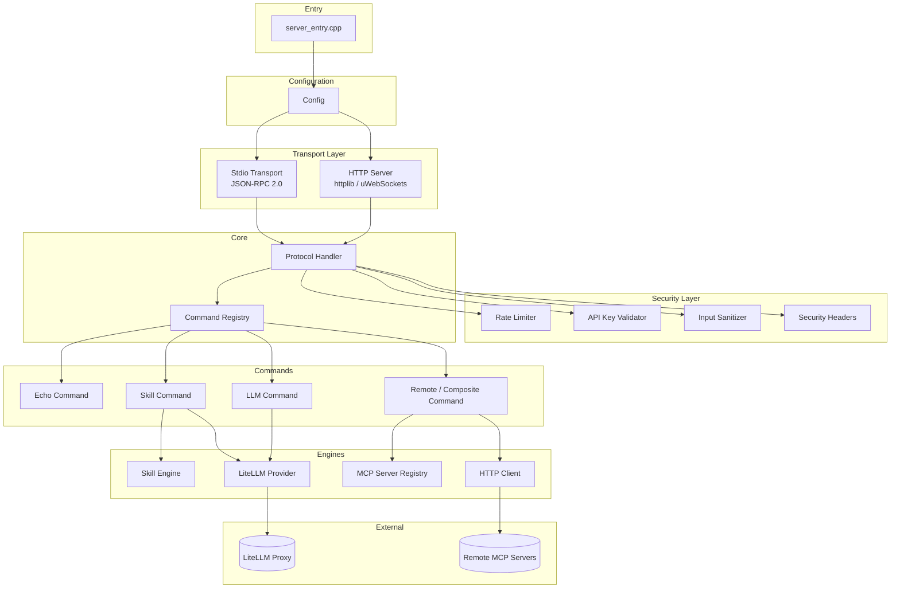
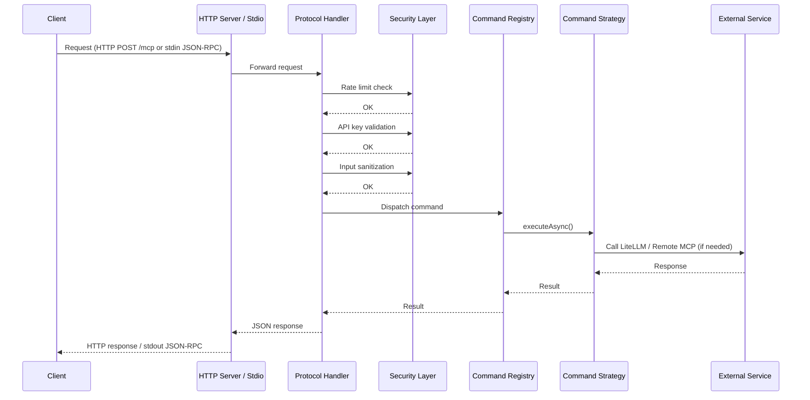

# MCP Server (C++ / CMake)

An enterprise-grade **Model Context Protocol (MCP)** server implemented in C++20. It exposes LLM tools, prompt-driven skills, and remote server discovery over both HTTP and stdio transports, following the MCP JSON-RPC 2.0 specification.

---

## Features

### MCP Tools

| Tool | Description |
|------|-------------|
| `echo` | Simple echo for connectivity testing |
| `llm` | LLM completion via a LiteLLM proxy (multi-provider: OpenAI, Anthropic, etc.) |
| `skill` | Prompt-template engine — loads JSON skill definitions with `{{variable}}` interpolation |
| `remote` | Composite command that delegates calls to other registered MCP servers |

### Dual Transport

- **HTTP** — Default transport powered by [cpp-httplib](https://github.com/yhirose/cpp-httplib); optional high-performance async mode via [uWebSockets](https://github.com/uNetworking/uWebSockets) (`-DUSE_UWS=ON`).
- **Stdio** — Full MCP JSON-RPC 2.0 over stdin/stdout (`--stdio` flag). Binary-safe on Windows.

### HTTP REST API

| Endpoint | Method | Description |
|----------|--------|-------------|
| `/mcp` | POST | Main MCP protocol handler (protected) |
| `/health` | GET | Health check |
| `/skills` | GET | List available skills |
| `/servers` | GET | List remote MCP servers |
| `/commands` | GET | List registered commands |

### Security

- **Rate Limiting** — Token-bucket algorithm per client IP
- **API Key Authentication** — Optional header-based API key validation
- **Input Sanitization** — Payload size limits (1 MB default), JSON nesting depth (max 32), string length caps
- **Security Headers** — Standard HTTP security headers on every response

### Skill Engine

Define reusable prompt templates as JSON files in the `skills/` directory:

```jsonc
{
  "name": "code_review",
  "description": "Review code for quality and bugs",
  "prompt_template": "Review the following {{language}} code:\n{{code}}",
  "default_model": "claude-sonnet",
  "required_variables": ["language", "code"]
}
```

### Remote Server Discovery

Route tool calls to other MCP servers via `config/mcp_servers.json`. Each server entry declares capabilities, priority, and timeout — the composite command picks the best match automatically.

### C API & C# Interop

A shared-library C API (`mcp_capi`) exposes lifecycle, command, LLM, skill, and discovery functions for P/Invoke from .NET or any FFI-capable language.

---

## Supported Platforms

| OS | Compiler | Minimum Version |
|----|----------|-----------------|
| **Windows** | MSVC (Visual Studio 2022) | v17+ with Desktop C++ workload |
| **Linux** | GCC | 10+ |
| **Linux** | Clang | 10+ |
| **macOS** | Apple Clang (Xcode) | 14+ |

> All platforms require **CMake 3.15+** and a compiler with **C++20** support.

---

## Architecture

### High-Level Component Diagram



### Request Flow



### Directory Structure

```
MCP_Open/
├── include/                # Public headers
│   ├── commands/           #   Command registry & ICommandStrategy
│   ├── core/               #   ProtocolHandler, Config, Logger, ThreadPool
│   ├── discovery/          #   McpServerRegistry, CompositeCommand
│   ├── http/               #   IHttpClient interface
│   ├── llm/                #   ILLMProvider, LiteLLMProvider, LLMCommand
│   ├── security/           #   RateLimiter, ApiKeyValidator, SecurityHeaders
│   ├── server/             #   IServer, HttplibServer, UwsServer, StdioTransport
│   ├── skills/             #   SkillEngine, SkillCommand
│   └── validation/         #   InputSanitizer, JsonSchemaValidator
├── src/                    # Implementation files (mirrors include/)
├── capi/                   # C API for FFI / P/Invoke
│   ├── include/mcp_capi.h
│   └── src/mcp_capi.cpp
├── csharp/                 # C# wrapper (McpClient.csproj)
├── config/                 # Example configuration files
├── skills/                 # Skill definition JSONs
├── tests/                  # Unit tests (GTest / Catch2)
├── litellm/                # LiteLLM proxy launcher & config
├── CMakeLists.txt          # Build system
└── BUILD.md                # Detailed build instructions
```

---

## Dependencies

All fetched automatically via CMake `FetchContent`:

| Library | Version | Purpose |
|---------|---------|---------|
| [nlohmann/json](https://github.com/nlohmann/json) | 3.11.2 | JSON serialization |
| [json-schema-validator](https://github.com/pboettch/json-schema-validator) | 2.3.0 | JSON Schema validation |
| [cpp-httplib](https://github.com/yhirose/cpp-httplib) | 0.26.0 | HTTP client & server |
| [uWebSockets](https://github.com/uNetworking/uWebSockets) | 20.47.0 | Async WebSocket server (optional) |
| [Google Test](https://github.com/google/googletest) | 1.14.0 | Unit testing (default) |
| [Catch2](https://github.com/catchorg/Catch2) | 3.5.2 | Unit testing (alternative) |

**Platform-specific:** pthreads (Linux), CoreFoundation & CFNetwork (macOS).

---

## Quick Start

### Build

```bash
# Clone & configure
cd MCP_Open
cmake -B build -DCMAKE_BUILD_TYPE=Release

# Build
cmake --build build --config Release

# Run
./build/mcp_server                # HTTP mode (default)
./build/mcp_server --stdio        # Stdio / MCP mode
```

#### Windows (Visual Studio)

```powershell
cmake -B build -G "Visual Studio 17 2022"
cmake --build build --config Release
build\Release\mcp_server.exe
```

### CMake Options

| Option | Default | Description |
|--------|---------|-------------|
| `USE_UWS` | `OFF` | Use uWebSockets async server |
| `BUILD_CSHARP` | `ON` | Build C# wrapper (requires .NET 8 SDK) |
| `TEST_FRAMEWORK` | `GTest` | `GTest` or `Catch2` |

---

## Configuration

| File | Purpose |
|------|---------|
| `config/mcp_config.json` | Server port, thread pool size, rate limits, auth, LiteLLM URL |
| `config/mcp_servers.json` | Remote MCP server endpoints for discovery |
| `skills/*.json` | Skill prompt template definitions |
| `litellm/litellm_config.yaml` | LiteLLM proxy model routing |

Copy the `.example` files and edit to taste:

```bash
cp config/mcp_config.json.example config/mcp_config.json
cp config/mcp_servers.json.example config/mcp_servers.json
```

---

## Testing

```bash
# Run all tests
ctest --test-dir build -C Release --output-on-failure

# Or run directly
./build/unit_tests            # Linux / macOS
build\Release\unit_tests.exe  # Windows
```

Test suites cover: protocol handling, command registry, input sanitization, rate limiting, configuration, skill engine, server discovery, and stdio transport.

---

## License

This project is licensed under the **MIT License** — see the [LICENSE](LICENSE) file for details.

**Attribution requirement:** If you use this MCP server or any part of its codebase in your project, you must give appropriate credit to the original author by including the following notice in your documentation or source:

> MCP Server (C++ / CMake) by Rakesh Kumar Raparla — [github.com/rraparla](https://github.com/rraparla)
