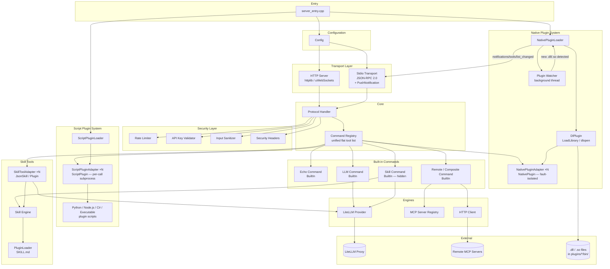
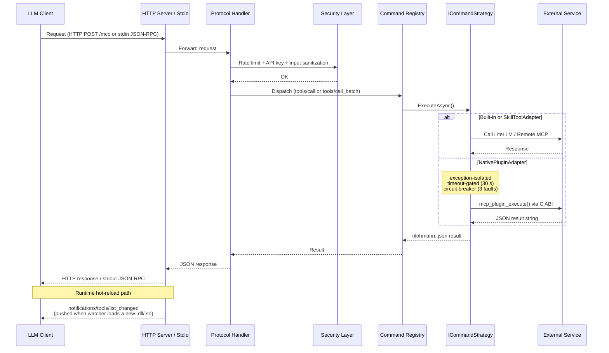
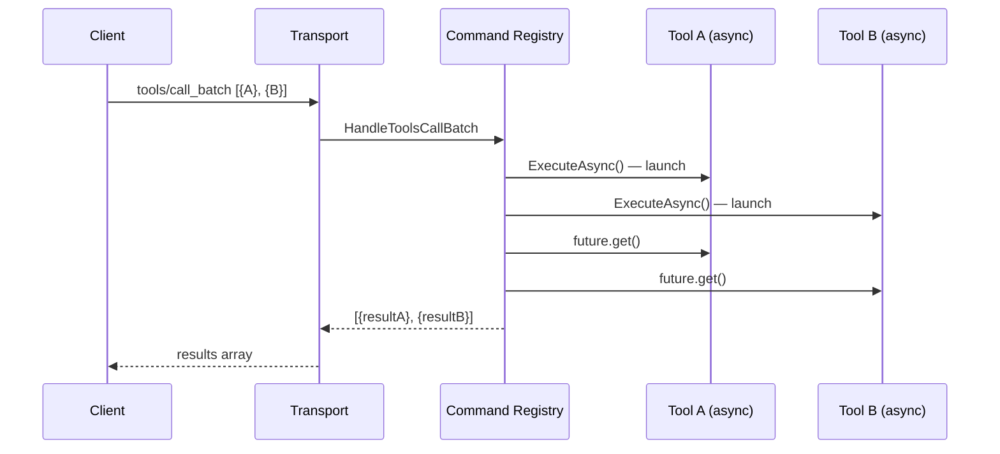

# MCP Server (C++ / CMake)

An enterprise-grade **Model Context Protocol (MCP)** server implemented in C++20. It exposes LLM tools, prompt-driven skills, and remote server discovery over both HTTP and stdio transports, following the MCP JSON-RPC 2.0 specification.

---

## Features

### MCP Tools

| Tool | Description |
| ---- | ----------- |
| `echo` | Simple echo for connectivity testing |
| `llm` | LLM completion via a LiteLLM proxy (multi-provider: OpenAI, Anthropic, etc.) |
| `skill` | Prompt-template engine — loads JSON skill definitions with `{{variable}}` interpolation |
| `remote` | Composite command that delegates calls to other registered MCP servers |

### Dual Transport

- **HTTP** — Default transport powered by [cpp-httplib](https://github.com/yhirose/cpp-httplib); optional high-performance async mode via [uWebSockets](https://github.com/uNetworking/uWebSockets) (`-DUSE_UWS=ON`).
- **Stdio** — Full MCP JSON-RPC 2.0 over stdin/stdout (`--stdio` flag). Binary-safe on Windows.

### HTTP REST API

| Endpoint | Method | Description |
| -------- | ------ | ----------- |
| `/mcp` | POST | Main MCP protocol handler (protected) |
| `/health` | GET | Health check |
| `/skills` | GET | List available skills |
| `/servers` | GET | List remote MCP servers |
| `/commands` | GET | List registered commands |

### Security

- **Rate Limiting** — Token-bucket algorithm per client IP
- **API Key Authentication** — Optional header-based API key validation
- **Input Sanitization** — Payload size limits (1 MB default), JSON nesting depth (max 32), string length caps
- **Security Headers** — Standard HTTP security headers on every response

### Skill Engine

Define reusable prompt templates as JSON files in the `skills/` directory:

```jsonc
{
  "name": "code_review",
  "description": "Review code for quality and bugs",
  "prompt_template": "Review the following {{language}} code:\n{{code}}",
  "default_model": "claude-sonnet",
  "required_variables": ["language", "code"]
}
```

### Remote Server Discovery

Route tool calls to other MCP servers via `config/mcp_servers.json`. Each server entry declares capabilities, priority, and timeout — the composite command picks the best match automatically.

### C API & C# Interop

A shared-library C API (`mcp_capi`) exposes lifecycle, command, LLM, skill, and discovery functions for P/Invoke from .NET or any FFI-capable language.

---

## Supported Platforms

| OS | Compiler | Minimum Version |
| -- | -------- | --------------- |
| **Windows** | MSVC (Visual Studio 2022) | v17+ with Desktop C++ workload |
| **Linux** | GCC | 10+ |
| **Linux** | Clang | 10+ |
| **macOS** | Apple Clang (Xcode) | 14+ |

> All platforms require **CMake 3.15+** and a compiler with **C++20** support.

---

## Architecture

### High-Level Component Diagram



**Key design decisions:**

| Decision | Rationale |
| -------- | --------- |
| **Unified `CommandRegistry`** | Every tool — built-in, JSON skill, SKILL.md plugin, native DL plugin, script plugin — is a flat `ICommandStrategy`. `tools/list` is a single filtered view. |
| **`skill` meta-tool hidden** | Kept for backward compat but `m_Hidden = true` so it doesn't appear in `tools/list`. Skills are promoted as individual first-class tools. |
| **C ABI for native plugins** | `extern "C"` is the only ABI that is stable across compilers, compiler versions, and standard libraries. Plugin authors compile with any toolchain. |
| **`NativePluginAdapter` fault isolation** | Three protection layers: exception catch → `isError`, 30 s `wait_for` timeout, circuit breaker after 3 faults. A broken plugin cannot crash the host. |
| **Runtime watcher + MCP notification** | The watcher polls `plugins/*/bin/` every 2 s. When a new DL appears it loads, registers tools, and pushes `notifications/tools/list_changed` to the stdio client so LLMs refresh their tool list without reconnecting. |

### Request Flow



#### Parallel execution (`tools/call_batch`)

All calls in a batch are launched as `std::async` futures before any `.get()` is called — true within-request parallelism. Total latency ≈ max(individual latencies).



### Directory Structure

```text
MCP_Open/
├── include/                  # Public headers
│   ├── commands/             #   CommandRegistry, ICommandStrategy, ToolMetadata
│   │                         #     ToolSource: BuiltIn | JsonSkill | Plugin | NativePlugin | ScriptPlugin
│   ├── core/                 #   ProtocolHandler, Config, Logger, ThreadPool
│   ├── discovery/            #   McpServerRegistry, CompositeCommand
│   ├── http/                 #   IHttpClient
│   ├── llm/                  #   ILLMProvider, LiteLLMProvider, LLMCommand
│   ├── plugins/              #   Plugin systems
│   │   ├── PluginABI.h       #     Stable extern "C" ABI contract (native plugin authors include this)
│   │   ├── IPlugin.h         #     Abstract C++ interface (mockable in tests)
│   │   ├── DlPlugin.h        #     Concrete LoadLibrary/dlopen loader
│   │   ├── NativePluginAdapter.h  # ICommandStrategy wrapper with fault isolation
│   │   ├── NativePluginLoader.h  # Directory scanner, watcher, notify callback
│   │   ├── ScriptPlugin.h    #     POD structs: ScriptPluginToolInfo, ScriptPlugin
│   │   ├── ScriptPluginAdapter.h # ICommandStrategy wrapper — per-call subprocess spawn
│   │   └── ScriptPluginLoader.h  # Scans plugin dirs for plugin.json with "runtime" key
│   ├── security/             #   RateLimiter, ApiKeyValidator, SecurityHeaders
│   ├── server/               #   IServer, HttplibServer, UwsServer, StdioTransport
│   ├── skills/               #   SkillEngine, SkillCommand, SkillToolAdapter, PluginLoader
│   └── validation/           #   InputSanitizer, JsonSchemaValidator
├── src/                      # Implementation files (mirrors include/)
│   ├── plugins/              #   DlPlugin.cpp, NativePluginAdapter.cpp, NativePluginLoader.cpp
│   │                         #   ScriptPluginAdapter.cpp, ScriptPluginLoader.cpp
│   └── ...
├── plugins/                  # Plugin directory (loaded at runtime)
│   └── example_plugin/       #   Reference native plugin
│       ├── bin/              #     Built output: example_plugin.dll / libexample_plugin.so
│       ├── src/
│       │   └── example_plugin.cpp   # Full source: ping + base64_encode tools
│       └── CMakeLists.txt    #     Standalone or in-tree build
├── skills/                   # JSON skill definitions (loaded at startup)
│   ├── code_review.json
│   ├── summarize.json
│   └── translate.json
├── capi/                     # C API for FFI / P/Invoke
│   ├── include/mcp_capi.h
│   └── src/mcp_capi.cpp
├── csharp/                   # C# wrapper (McpClient.csproj)
├── config/                   # Example configuration files
├── tests/                    # Unit tests (GTest / Catch2) — 179 tests (167 pass, 12 skip without Python)
│   └── test_plugins/         #   Fixture script plugins used by integration tests
│       └── echo-plugin/      #     echo_tool + fail_tool Python plugin
├── litellm/                  # LiteLLM proxy launcher & config
├── CMakeLists.txt            # Build system
└── BUILD.md                  # Detailed build instructions
```

---

## Dependencies

All fetched automatically via CMake `FetchContent`:

| Library | Version | Purpose |
| ------- | ------- | ------- |
| [nlohmann/json](https://github.com/nlohmann/json) | 3.11.2 | JSON serialization |
| [json-schema-validator](https://github.com/pboettch/json-schema-validator) | 2.3.0 | JSON Schema validation |
| [cpp-httplib](https://github.com/yhirose/cpp-httplib) | 0.26.0 | HTTP client & server |
| [uWebSockets](https://github.com/uNetworking/uWebSockets) | 20.47.0 | Async WebSocket server (optional) |
| [Google Test](https://github.com/google/googletest) | 1.14.0 | Unit testing (default) |
| [Catch2](https://github.com/catchorg/Catch2) | 3.5.2 | Unit testing (alternative) |

**Platform-specific:** pthreads (Linux), CoreFoundation & CFNetwork (macOS).

---

## Quick Start

### Build

```bash
# Clone & configure
cd MCP_Open
cmake -B build -DCMAKE_BUILD_TYPE=Release

# Build
cmake --build build --config Release

# Run
./build/mcp_server                # HTTP mode (default)
./build/mcp_server --stdio        # Stdio / MCP mode
```

#### Windows (Visual Studio)

```powershell
cmake -B build -G "Visual Studio 17 2022"
cmake --build build --config Release
build\Release\mcp_server.exe
```

### CMake Options

| Option | Default | Description |
| ------ | ------- | ----------- |
| `USE_UWS` | `OFF` | Use uWebSockets async server |
| `BUILD_CSHARP` | `ON` | Build C# wrapper (requires .NET 8 SDK) |
| `TEST_FRAMEWORK` | `GTest` | `GTest` or `Catch2` |

---

## Integrations

### Claude Code

Register the server with [Claude Code](https://claude.ai/code) so it is available as a tool source in your AI-assisted development workflow.

#### Register with `claude mcp add`

##### Linux / macOS

```bash
claude mcp add mcp-open -- /path/to/MCP_Open/build/mcp_server
```

##### Windows

```powershell
claude mcp add mcp-open -- "C:\path\to\MCP_Open\build\Release\mcp_server.exe"
```

With LiteLLM API keys (required for `llm` and `skill` tools):

```bash
# Linux / macOS
claude mcp add mcp-open \
  --env ANTHROPIC_API_KEY=sk-ant-... \
  --env LITELLM_MASTER_KEY=sk-litellm-... \
  -- /path/to/build/mcp_server

# Windows
claude mcp add mcp-open ^
  --env ANTHROPIC_API_KEY=sk-ant-... ^
  --env LITELLM_MASTER_KEY=sk-litellm-... ^
  -- "C:\path\to\build\Release\mcp_server.exe"
```

With MCP server API key (if `api_key` is set in `config/mcp_config.json`):

```bash
claude mcp add mcp-open --env MCP_API_KEY=your-api-key -- /path/to/build/mcp_server
```

#### Scope Options

| Scope | Flag | Stored in | When to use |
| ----- | ---- | --------- | ----------- |
| `local` (default) | _(omit)_ | `.claude/` in the current directory | Personal, single-project use |
| `project` | `--scope project` | `.mcp.json` alongside source code | Shared with the team via VCS |
| `user` | `--scope user` | `~/.claude/` | Available across all projects on this machine |

```bash
# Share with team via source control
claude mcp add --scope project mcp-open -- /path/to/build/mcp_server

# Register globally for all projects
claude mcp add --scope user mcp-open -- /path/to/build/mcp_server
```

#### Verify

```bash
claude mcp list           # Confirm mcp-open appears
claude mcp get mcp-open   # Inspect connection details
```

Or from within a Claude Code session: `/mcp`

#### Available Tools After Registration

| Tool | Example prompt |
| ---- | -------------- |
| `echo` | "Use the echo tool to test the MCP connection" |
| `llm` | "Use the llm tool to summarize this file" |
| `skill` | "Run the code_review skill on this function" |
| `remote` | "Use the remote tool to query my other registered MCP servers" |

---

### LiteLLM Proxy (All LLMs)

Expose this server's tools to **every LLM** routed through your LiteLLM proxy — no per-client configuration required.

#### Step 1 — Start the MCP Server in HTTP mode

```bash
# Linux / macOS
./build/mcp_server          # Listens on the port in config/mcp_config.json (default 8080)

# Windows
build\Release\mcp_server.exe
```

#### Step 2 — Add to `litellm/litellm_config.yaml`

```yaml
mcp_servers:
  mcp_open:
    url: "http://localhost:8080"   # Match the port in config/mcp_config.json
    transport: "http"
    allow_all_keys: true           # Available to every API key / team
```

Alternatively, let the proxy spawn the process directly via stdio:

```yaml
mcp_servers:
  mcp_open:
    transport: "stdio"
    command: "/path/to/build/mcp_server"
    args: ["--stdio"]
    env:
      MCP_API_KEY: os.environ/MCP_API_KEY
    allow_all_keys: true
```

#### Step 3 — Start the LiteLLM Proxy

```bash
# Linux / macOS
cd litellm && ./start_proxy.sh

# Windows
cd litellm && .\start_proxy.ps1
```

#### Step 4 — Call Tools via Any LLM

```bash
curl http://localhost:4000/v1/chat/completions \
  -H "Authorization: Bearer $LITELLM_MASTER_KEY" \
  -H "Content-Type: application/json" \
  -d '{
    "model": "claude-sonnet",
    "messages": [{"role": "user", "content": "Summarize this code using available tools"}],
    "tools": [{"type": "mcp", "server_url": "litellm_proxy", "require_approval": "never"}]
  }'
```

All models in `litellm_config.yaml` (`claude-sonnet`, `gpt-4o`, `gemini-pro`, …) automatically have access to all registered tools including promoted skill and plugin tools.

---

## Script Plugins (Python / Node.js / C# / Executable)

Script plugins extend the server with tools written in any language. Each call spawns a fresh subprocess, reads stdout, and the process exits. No persistent IPC or language runtime embedding is required.

### Plugin Directory Layout

```text
plugins/
└── my-python-plugin/
    ├── plugin.json          # MUST contain "runtime" and "entrypoint"
    └── scripts/
        └── plugin.py        # (or .js / .dll / .exe — relative to plugin dir)
```

### `plugin.json` — Script Plugin Fields

```json
{
  "name":       "my-python-plugin",
  "version":    "1.0.0",
  "runtime":    "python",
  "entrypoint": "scripts/plugin.py"
}
```

| `runtime` value | Windows executable | Linux/macOS executable |
| --------------- | ------------------ | ---------------------- |
| `"python"` | `python` | `python3` |
| `"node"` | `node` | `node` |
| `"dotnet"` | `dotnet` | `dotnet` |
| `"executable"` | entrypoint IS the exe — no prefix | same |
| anything else | used as-is (e.g. `"python3"`, `"node20"`) | same |

### Plugin Protocol

**Discovery** — called once at startup:

```text
<runtime> "<entrypoint>" --mcp-list
stdout → [{"name":"tool_name","description":"...","inputSchema":{...}}, ...]
```

**Execution** — called once per `tools/call`. Arguments are passed via a temp JSON file (eliminates shell-escaping):

```text
<runtime> "<entrypoint>" --mcp-call <tool_name> --mcp-args-file "<tmp.json>"
stdout → {"status":"ok","content":"result text"}
       | {"status":"error","error":"message"}
```

### Python Plugin Example

```python
# plugin.py
import sys, json, argparse

TOOLS = [
    {
        "name": "echo_tool",
        "description": "Echoes a message back",
        "inputSchema": {
            "type": "object",
            "properties": {"message": {"type": "string"}},
            "required": ["message"]
        }
    }
]

parser = argparse.ArgumentParser(add_help=False)
parser.add_argument("--mcp-list",      action="store_true")
parser.add_argument("--mcp-call",      metavar="TOOL")
parser.add_argument("--mcp-args-file", metavar="FILE")
args, _ = parser.parse_known_args()

if args.mcp_list:
    sys.stdout.write(json.dumps(TOOLS) + "\n")

elif args.mcp_call == "echo_tool":
    with open(args.mcp_args_file) as f:
        payload = json.load(f)
    sys.stdout.write(json.dumps({"status": "ok", "content": payload["message"]}) + "\n")
```

### TypeScript / Node.js Plugin with Zod (v4+)

Zod v4's built-in `z.toJSONSchema()` generates the `inputSchema` at runtime — single source of truth for schema AND validation. Requires `npm install zod@^4`.

```javascript
// plugin.js  (or compiled from TypeScript)
const { z } = require('zod');
const fs    = require('fs');

const EchoSchema = z.object({
    message: z.string().describe("Text to echo back")
});

const TOOLS = [
    {
        name:        "echo_tool",
        description: "Echoes a message back",
        inputSchema: z.toJSONSchema(EchoSchema, { target: "draft-07" })
    }
];

const argv = process.argv.slice(2);

if (argv.includes("--mcp-list")) {
    process.stdout.write(JSON.stringify(TOOLS) + "\n");

} else if (argv.includes("--mcp-call")) {
    const toolName  = argv[argv.indexOf("--mcp-call") + 1];
    const argsFile  = argv[argv.indexOf("--mcp-args-file") + 1];
    try {
        const raw  = JSON.parse(fs.readFileSync(argsFile, "utf-8"));
        if (toolName === "echo_tool") {
            const args = EchoSchema.parse(raw);   // runtime validation via Zod
            process.stdout.write(JSON.stringify({ status: "ok", content: args.message }) + "\n");
        } else {
            process.stdout.write(JSON.stringify({ status: "error", error: `Unknown tool: ${toolName}` }) + "\n");
        }
    } catch (err) {
        process.stdout.write(JSON.stringify({ status: "error", error: String(err) }) + "\n");
        process.exit(1);
    }
}
```

> **Zod v3 users**: Use the `zod-to-json-schema` package instead of `z.toJSONSchema()`.

### `plugin.json` for Node.js

```json
{
  "name":       "my-node-plugin",
  "version":    "1.0.0",
  "runtime":    "node",
  "entrypoint": "scripts/plugin.js"
}
```

### C# Plugin Checklist

- `"runtime": "dotnet"` — entry point is a `.dll` built with `dotnet build`
- `"runtime": "executable"` — entry point is a self-contained `.exe`
- Use `Environment.GetCommandLineArgs()` and `System.Text.Json` for I/O
- Stdout must be a **single line** per command invocation

### Tool name validation

Tool names must match `[a-zA-Z0-9_-]+`. Names that fail validation are logged and skipped at discovery time.

---

## Tool Chaining

A tool can include a `"chain"` field in its result to immediately invoke another tool with derived arguments — no LLM round-trip required. The MCP client receives only the final result; all intermediate hops are invisible.

### Chain response format (from any tool)

```json
{
  "status":  "ok",
  "content": "step 1 done",
  "chain":   { "tool": "next_tool", "args": { "input": "derived value" } }
}
```

### Cross-source chaining

`CommandRegistry::ExecuteWithChaining` detects the `"chain"` field after every `ExecuteAsync` call, making chaining source-agnostic:

| Tool source | Can initiate chain | Can be chained to |
| ----------- | ------------------ | ----------------- |
| `BuiltIn` | Yes | Yes |
| `JsonSkill` | Yes | Yes |
| `Plugin` (SKILL.md) | Yes | Yes |
| `NativePlugin` (.dll/.so) | Yes | Yes |
| `ScriptPlugin` (Python/Node/C#) | Yes | Yes |

Maximum chain depth is **5** (`kMaxChainDepth`). Exceeding it returns the last result without further chaining and logs a warning.

---

## Plugins (SKILL.md)

Plugins extend the server with additional tools without modifying C++ code. Each plugin is a directory containing a `plugin.json` manifest and one or more skills defined as `SKILL.md` files. At startup the server promotes every skill into its own first-class MCP tool, so any LLM can discover and call them directly via `tools/list`.

### SKILL.md Plugin Directory Layout

```text
plugins/
└── my_plugin/
    ├── plugin.json          # Plugin metadata
    └── skills/
        └── code_review/
            ├── SKILL.md     # Required — defines the tool
            ├── scripts/     # Optional — executable helpers
            ├── references/  # Optional — docs loaded into context
            └── assets/      # Optional — templates / static files
```

### `SKILL.md` Format

```markdown
---
name: code_review
description: Review code for bugs, style issues, and improvements
variables:
  - code
  - language
---

Review the following {{language}} code for bugs, style issues, and improvements:

\`\`\`{{language}}
{{code}}
\`\`\`

Provide structured feedback: 1) Bugs, 2) Style, 3) Improvements.
```

**Frontmatter fields:**

| Field | Required | Description |
| --- | --- | --- |
| `name` | No (falls back to dir name) | Tool name registered in MCP |
| `description` | Yes | Shown to LLMs in `tools/list` — make it specific |
| `variables` | No | List of `{{placeholder}}` names that callers must supply |

The Markdown body after the closing `---` becomes the `prompt_template`. Use `{{variable_name}}` placeholders — they are interpolated at call time and sanitized against injection.

### `plugin.json` Format

```json
{
  "name": "my-plugin",
  "description": "Short description of what this plugin provides",
  "author": { "name": "Your Name" },
  "keywords": ["tag1", "tag2"]
}
```

### Adding a Plugin

1. Create the plugin directory structure under `plugins/` (relative to the server working directory or the path set in `config/mcp_config.json`).

2. Write your `SKILL.md` files following the format above.

3. Restart the server — plugins are loaded at startup. The new tools appear immediately in `tools/list`:

```bash
# Verify via REST
curl http://localhost:8080/skills

# Verify via MCP stdio
echo '{"jsonrpc":"2.0","id":1,"method":"tools/list","params":{}}' | ./build/mcp_server --stdio
```

1. Optionally configure the plugins directory in `config/mcp_config.json`:

```json
{
  "plugins": {
    "directory": "/absolute/path/to/plugins"
  }
}
```

Or set the path via the `plugins.directory` key for a non-default location.

### Calling a Plugin Tool

Once loaded, each skill is a first-class MCP tool. No skill-layer knowledge is required:

```bash
# tools/call — direct, works with any LLM
echo '{
  "jsonrpc": "2.0",
  "id": 1,
  "method": "tools/call",
  "params": {
    "name": "code_review",
    "arguments": {
      "code": "int x = foo();",
      "language": "cpp"
    }
  }
}' | ./build/mcp_server --stdio
```

### Parallel Skill Execution

When using the stdio transport (or any async server), multiple skills can execute in parallel using the `tools/call_batch` extension:

```json
{
  "jsonrpc": "2.0",
  "id": 1,
  "method": "tools/call_batch",
  "params": {
    "calls": [
      {
        "name": "code_review",
        "arguments": { "code": "int x = foo();", "language": "cpp" }
      },
      {
        "name": "summarize",
        "arguments": { "input": "Long article text..." }
      }
    ]
  }
}
```

All calls are launched concurrently (`std::async`) before any result is collected, so total latency ≈ max(individual latencies) rather than their sum.

**Response format:**

```json
{
  "jsonrpc": "2.0",
  "id": 1,
  "result": {
    "results": [
      { "name": "code_review", "isError": false, "content": [{ "type": "text", "text": "..." }] },
      { "name": "summarize",   "isError": false, "content": [{ "type": "text", "text": "..." }] }
    ]
  }
}
```

Individual failures are isolated — a failed call sets `"isError": true` for that entry without cancelling the others.

> **uWebSockets note:** When built with `-DUSE_UWS=ON`, each HTTP POST to `/mcp` is already handled asynchronously at the connection level (multiple clients run concurrently). `tools/call_batch` provides the additional capability of running multiple skills in parallel within a single request.

---

## Configuration

| File | Purpose |
| ---- | ------- |
| `config/mcp_config.json` | Server port, thread pool size, rate limits, auth, LiteLLM URL |
| `config/mcp_servers.json` | Remote MCP server endpoints for discovery |
| `skills/*.json` | Skill prompt template definitions |
| `litellm/litellm_config.yaml` | LiteLLM proxy model routing |

Copy the `.example` files and edit to taste:

```bash
cp config/mcp_config.json.example config/mcp_config.json
cp config/mcp_servers.json.example config/mcp_servers.json
```

---

## Testing

```bash
# Run all tests
ctest --test-dir build -C Release --output-on-failure

# Or run directly
./build/unit_tests            # Linux / macOS
build\Release\unit_tests.exe  # Windows
```

Test suites cover: protocol handling, command registry, input sanitization, rate limiting, configuration, skill engine, server discovery, stdio transport, native plugin system, script plugin adapter, and script plugin loader.

12 integration tests are conditionally skipped when Python is not on `PATH` — they run automatically once Python is installed.

---

## License

This project is licensed under the **MIT License** — see the [LICENSE](LICENSE) file for details.

**Attribution requirement:** If you use this MCP server or any part of its codebase in your project, you must give appropriate credit to the original author by including the following notice in your documentation or source:

> MCP Server (C++ / CMake) by Rakesh Kumar Raparla — [github.com/rraparla](https://github.com/rraparla)
